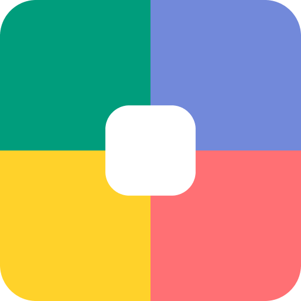
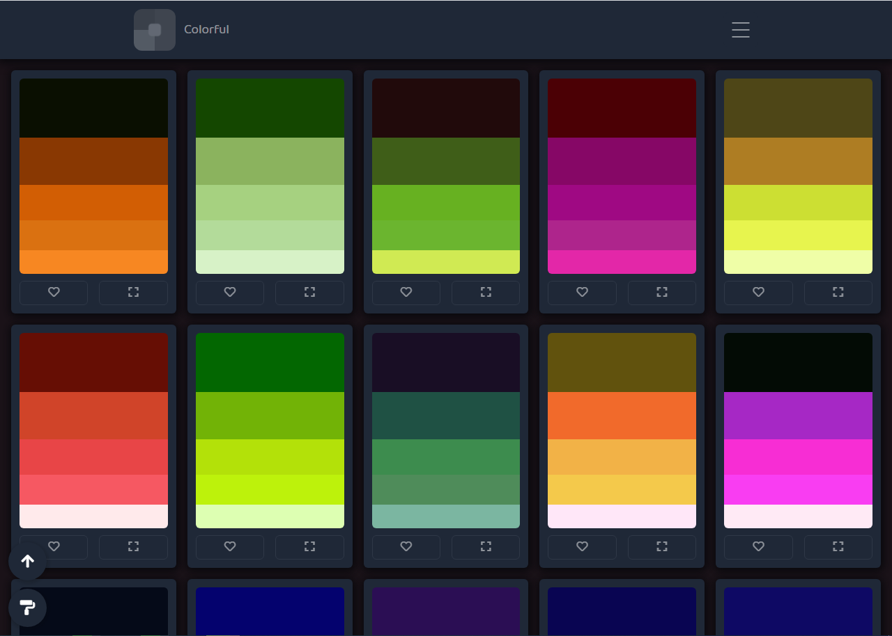
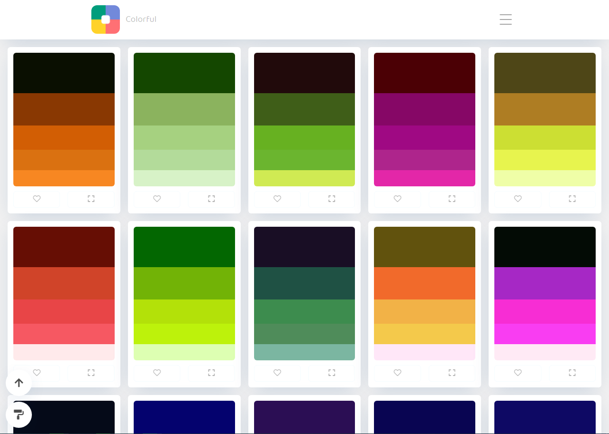
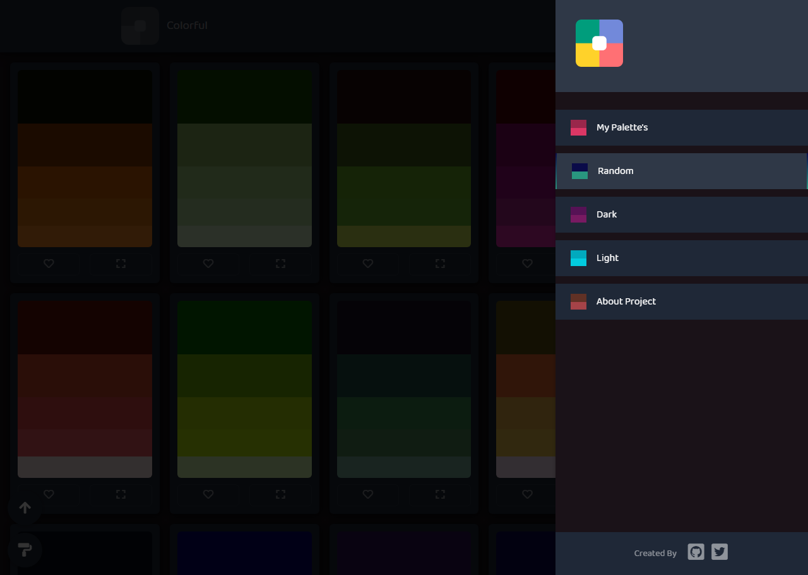

<p align="center">
  
  <h1 align="center">Colorful</h1>
  <p align="center">Infinitas paletas geradas por Scripts, salve elas ou copie uma de suas cores</p>
  <p align="center">
    
    
    
    
  </p>
  <p align="center">
    <a href="https://www.linkedin.com/in/laks-castro-9ab09a18b/" target="_blank">
      
    </a>
  </p>
</p>

<p align="center">
  
  
  
</p>

<p>
  
  <a href="https://github.com/LaksCastro/colorful/blob/master/README.md">Read in English</a>
</p>

## Como utilizar
É simples, abra [Site da Colorful](https://lakscastro.github.io/colorful/) e navegue entre as infinitas paletas, gostou de alguma? Basta clicar no coração, que ela estará salva na sua sessão do navegador, e para acessa-la basta ir até a guia "My Palette's', todas elas estarão lá :) Há tema Dark e Light, use o que te preferir, para alternar entre eles, basta clicar no pequeno botão no canto inferior esquerdo com ícone de pincel.

## Objetivo do projeto
Aprender a criar rotas e manipular o DOM via JavaScript e a configurar utilizar o Webpack e Babel para que a aplicação seja divida em módulos e compatível com a maioria dos navegadores, tudo sem utilizar nenhuma biblioteca ou framework JavaScript como React ou Vue

## Clonar o repositório para sua máquina
### Requisitos
- Node instalado
- Npm ou Yarn instalado

### Instalando
1. Clone o repositório usando o cliente do Github de sua preferência, ou faça o download do repositório  
Usando o cliente do Github via linha de comando:  
```
git clone https://github.com/LaksCastro/colorful.git
```

2. Instale as dependências:  
```
npm install || yarn install
```

3. Crie seu seu arquivo .env.dev e coloque a rota que estamos trabalhando como `PATH_BASE=/`, pois o Webpack Dev Server utiliza o servidor local com este endereço http://localhost:3000/
```
# .env.dev

BASE_PATH=/
```

Faça o mesmo para o .env.prod se for usar este projeto em produção, porém agora coloque o nome da rota relativa ao seu servidor, no caso deste repositório, `BASE_PATH=/colorful`

4. Inicie o Webpack Dev Server:
```
npm run start || yarn start
```

5. Para fazer a Build: 
```
npm run build || yarn build
```

## Construido com  
* [Webpack 4](https://webpack.js.org/) - Module Bundler.
* [Babel](https://babeljs.io/) - Transpilador JavaScript.
* [JavaScript](https://developer.mozilla.org/pt-BR/docs/Aprender/JavaScript) - A linguagem utilizada

## Autores
* [Laks Castro](https://github.com/LaksCastro) - /lakscastro

## Contribuidores
* [Gustavo](https://github.com/freazesss) - /freazesss

<br>
<br>
<br>
<br>

<h2 align="center">
  Open Source
</h2>
<p align="center">
  <sub>Copyright © 2020-present, Laks Castro.</sub>
</p>
<p align="center">Colorful <a href="https://github.com/LaksCastro/colorful/blob/master/LICENSE.md">is MIT licensed 💖</a></p>
<p align="center">
  
</p>
