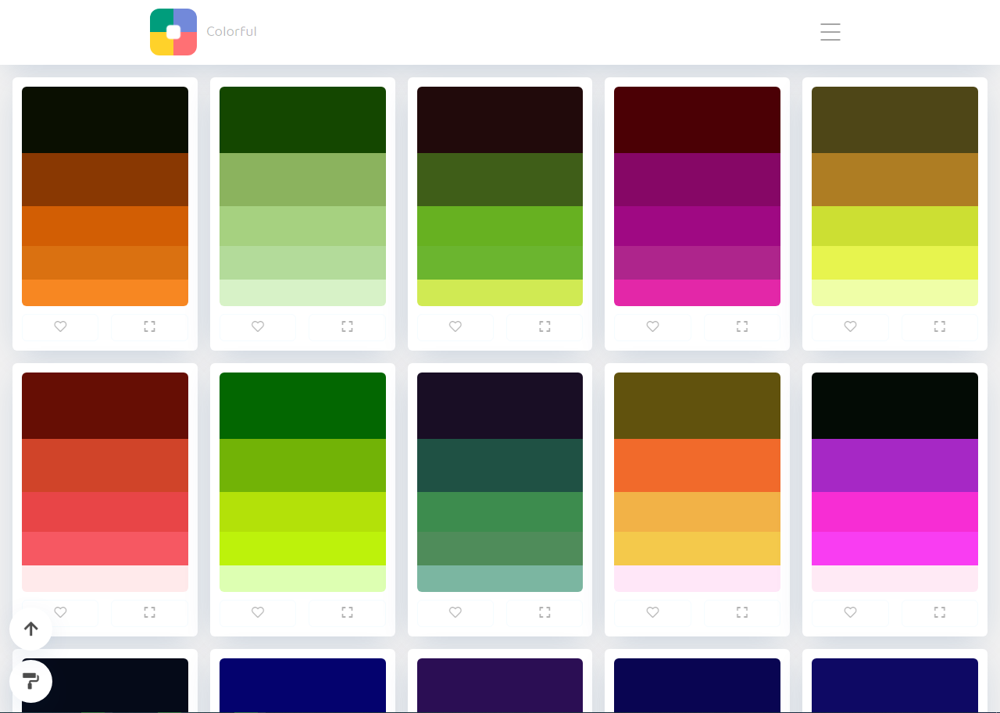
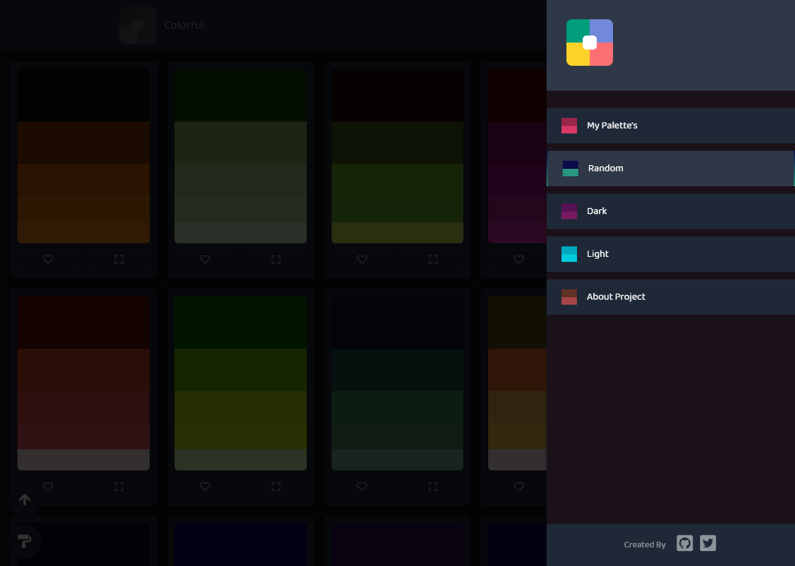

<p align="center">
  
  <h1 align="center">Colorful</h1>
  <p align="center">Infinitas paletas geradas por Scripts, salve elas ou copie uma de suas cores</p>
</p>

<p>
  
  <a href="https://github.com/LaksCastro/colorful/blob/master/README.md">Read in English</a>
</p>

## Como utilizar
É simples, abra [Site da Colorful](https://lakscastro.github.io/colorful/) e navegue entre as infinitas paletas, gostou de alguma? Basta clicar no coração, que ela estará salva na sua sessão do navegador, e para acessa-la basta ir até a guia "My Palette's', todas elas estarão lá :) Há tema Dark e Light, use o que te preferir, para alternar entre eles, basta clicar no pequeno botão no canto inferior esquerdo com ícone de pincel.

## Objetivo do projeto
Aprender a criar rotas e manipular o DOM via JavaScript e a configurar utilizar o Webpack e Babel para que a aplicação seja divida em módulos e compatível com a maioria dos navegadores, tudo sem utilizar nenhuma biblioteca ou framework JavaScript como React ou Vue

<p align="center">
  
  
  
</p>


## Clone the repository for your machine
Essas instruções fornecerão uma cópia do projeto em execução na sua máquina local para fins de desenvolvimento e teste. Consulte implantação para obter notas sobre como implantar o projeto em um sistema ativo.

### Requirements
- Node installed
- Npm or Yarn installed

### Installing
1. Clone the repository using the Github client of your choice, or download the repository
Using the Github client via the command line:
```
git clone https://github.com/LaksCastro/colorful.git
```

2. Install the dependencies:
```
npm install || yarn install
```

3. Create your .env.dev file and put the route we are working on as `PATH_BASE = /`, because the Webpack Dev Server uses the local server with this address http://localhost:3000/
```
# .env.dev

BASE_PATH=/
```

Do the same for .env.prod if you are going to use this project in production, but now put the name of the route relative to your server, in the case of this repository: `BASE_PATH=/colorful`

4. Start Webpack Dev Server:
```
npm run start || yarn start
```

5. Generate Build
```
npm run build || yarn build
```

## Built with
* [Webpack 4](https://webpack.js.org/) - Module Bundler.
* [Babel](https://babeljs.io/) - Transpilador JavaScript.
* [JavaScript](https://developer.mozilla.org/pt-BR/docs/Aprender/JavaScript) - A linguagem utilizada

## Authors
* [Laks Castro](https://github.com/LaksCastro) - /lakscastro

## Contributors
* [Gustavo](https://github.com/freazesss) - /freazesss

## License
This project is licensed under the MIT license - see the [LICENSE.md](LICENSE.md) archive for more details.
